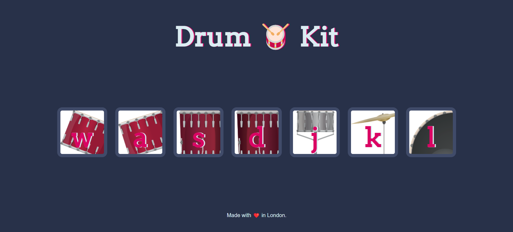

# Drum-Kit-Website
Developed a Drum Kit website using HTML, CSS, and JavaScript, featuring multiple interactive drum buttons. Each button produces a unique sound when clicked, enhancing user interaction. The project includes a responsive design for an engaging experience across devices.

## Features
<ul>-Interactive drum buttons created using HTML and CSS.</ul>
<ul>-Unique sounds produced for each drum button using JavaScript.</ul>
<ul>-Real-time audio feedback on button clicks for an engaging user experience.</ul>
<ul>-Visually appealing interface with custom styling.</ul>
<ul>-Keyboard support for playing drum sounds using corresponding keys.</ul>

## Screenshot
<ul></ul>
